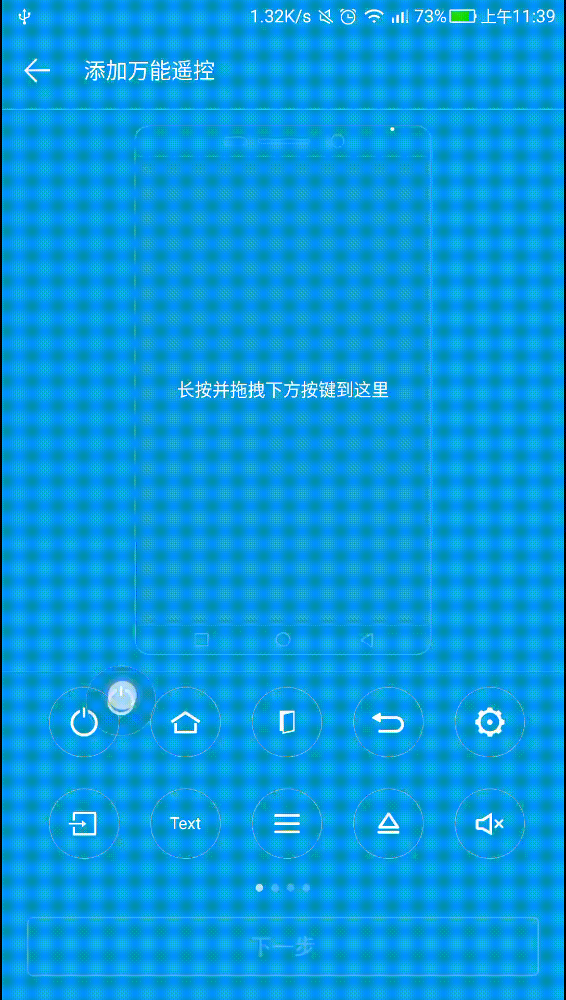
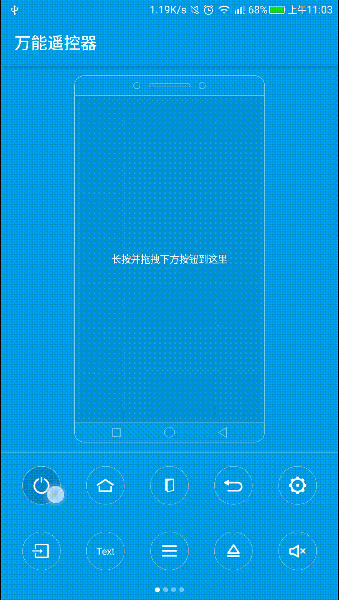

# RemoteControlView

RemoteControlView是模仿乐视遥控App添加万能遥控器的交互效果。

## Preview

原效果

 

实现效果

## 实现过程

具体参考这篇博客：[实现一款万能遥控器](http://blog.csdn.net/qq_17766199/article/details/79466506)

## License

	Copyright 2018 simplezhli

    Licensed under the Apache License, Version 2.0 (the "License");
    you may not use this file except in compliance with the License.
    You may obtain a copy of the License at

       http://www.apache.org/licenses/LICENSE-2.0

    Unless required by applicable law or agreed to in writing, software
    distributed under the License is distributed on an "AS IS" BASIS,
    WITHOUT WARRANTIES OR CONDITIONS OF ANY KIND, either express or implied.
    See the License for the specific language governing permissions and
    limitations under the License.
